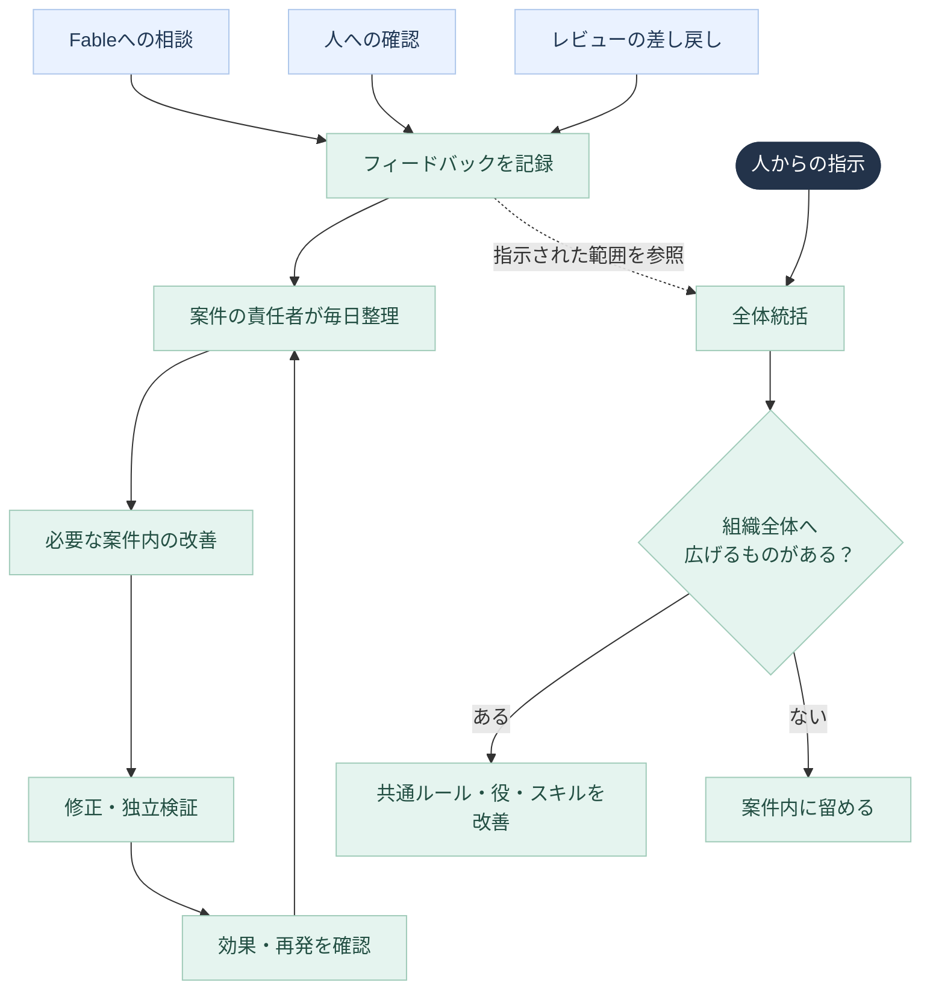

# フィードバックの流れ

```mermaid
flowchart TB
    F["Fableへの相談"] --> FB["フィードバックを記録"]
    H["人への確認"] --> FB
    R["レビューの差し戻し"] --> FB

    FB --> P["案件の責任者が毎日整理"]
    P --> A["必要な案件内の改善"]
    A --> V["修正・独立検証"]
    V --> E["効果・再発を確認"]
    E --> P

    U(["人からの指示"]) --> O["全体統括"]
    FB -. 指示された範囲を参照 .-> O
    O --> Q{"組織全体へ<br/>広げるものがある？"}
    Q -->|ある| G["共通ルール・役・スキルを改善"]
    Q -->|ない| N["案件内に留める"]

    classDef source fill:#eaf2ff,stroke:#aec7eb,color:#223956;
    classDef feedback fill:#e5f4ef,stroke:#a0cbb9,color:#234f43;
    classDef human fill:#23334a,stroke:#23334a,color:#fff;
    class F,H,R source;
    class FB,P,A,V,E,O,Q,G,N feedback;
    class U human;
```

相談後に解消済みのものも対象。実行手順は `監視と改善.md`、役の関係は [全体図](組織図.md)。
