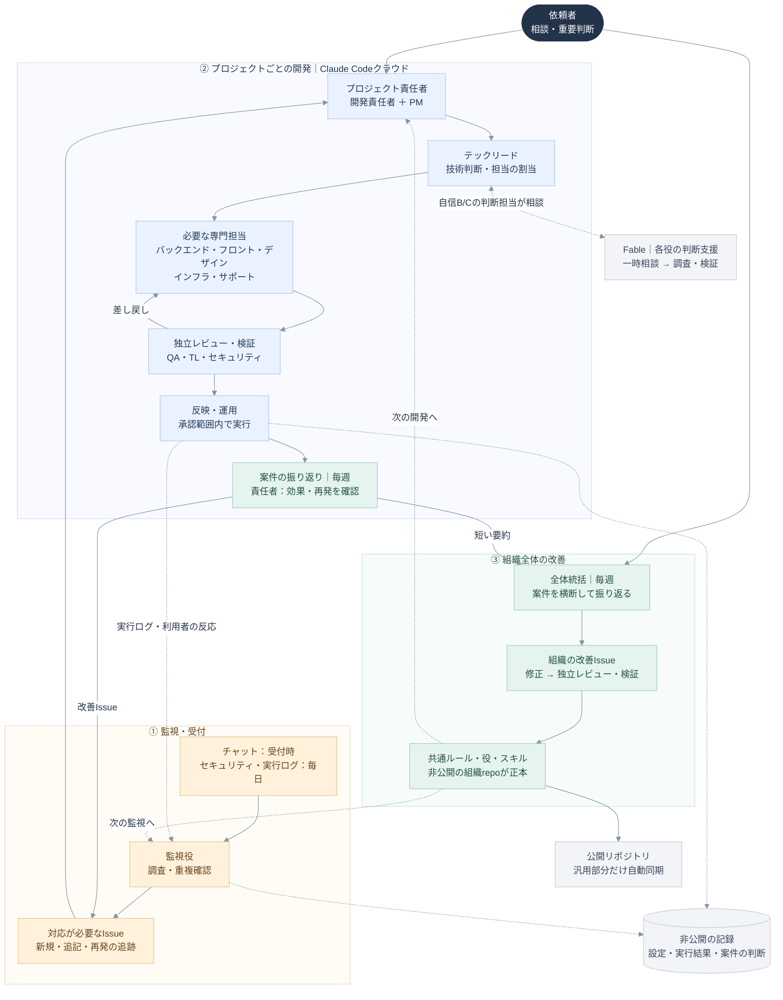

# 組織・監視・フィードバック

```mermaid
%%{init: {'theme': 'base', 'themeVariables': {'fontFamily': 'sans-serif', 'fontSize': '15px', 'primaryTextColor': '#243247', 'lineColor': '#8795a8', 'edgeLabelBackground': '#ffffff'}, 'flowchart': {'curve': 'basis', 'nodeSpacing': 24, 'rankSpacing': 36}}}%%
flowchart TB
    USER(["依頼者<br/>相談・重要判断"])

    subgraph MONITOR["① 監視・受付"]
        INPUT["チャット：受付時<br/>セキュリティ・実行ログ：毎日"]
        WATCH["監視役<br/>調査・重複確認"]
        ISSUE["対応が必要なIssue<br/>新規・追記・再発の追跡"]
        INPUT --> WATCH --> ISSUE
    end

    subgraph PROJECT["② プロジェクトごとの開発｜Claude Codeクラウド"]
        OWNER["プロジェクト責任者<br/>開発責任者 ＋ PM"]
        TL["テックリード<br/>技術判断・担当の割当"]
        TEAM["必要な専門担当<br/>バックエンド・フロント・デザイン<br/>インフラ・サポート"]
        REVIEW["独立レビュー・検証<br/>QA・TL・セキュリティ"]
        RESULT["反映・運用<br/>承認範囲内で実行"]
        RETRO["案件の振り返り｜毎週<br/>責任者：効果・再発を確認"]
        OWNER --> TL --> TEAM --> REVIEW --> RESULT --> RETRO
        REVIEW -->|差し戻し| TEAM
    end

    subgraph ORG["③ 組織全体の改善"]
        LEAD["全体統括｜毎週<br/>案件を横断して振り返る"]
        IMPROVE["組織の改善Issue<br/>修正 → 独立レビュー・検証"]
        RULES["共通ルール・役・スキル<br/>非公開の組織repoが正本"]
        LEAD --> IMPROVE --> RULES
    end

    FABLE["Fable｜各役の判断支援<br/>一時相談 → 調査・検証"]
    RECORDS[("非公開の記録<br/>設定・実行結果・案件の判断")]
    PUBLIC["公開リポジトリ<br/>汎用部分だけ自動同期"]

    USER --> OWNER
    USER --> LEAD
    ISSUE --> OWNER
    RESULT -.->|実行ログ・利用者の反応| WATCH
    RETRO -->|改善Issue| ISSUE
    RETRO -->|短い要約| LEAD
    RULES -.->|次の開発へ| OWNER
    RULES -.->|次の監視へ| WATCH
    TL <-.->|自信B/Cの判断担当が相談| FABLE
    RESULT -.-> RECORDS
    WATCH -.-> RECORDS
    RULES --> PUBLIC

    classDef person fill:#23334a,color:#ffffff,stroke:#23334a;
    classDef development fill:#eaf2ff,color:#223956,stroke:#aec7eb;
    classDef monitoring fill:#fff1dc,color:#65431c,stroke:#e4c38e;
    classDef improvement fill:#e5f4ef,color:#234f43,stroke:#a0cbb9;
    classDef neutral fill:#f2f4f7,color:#37465b,stroke:#c4ccd7;
    class USER person;
    class OWNER,TL,TEAM,REVIEW,RESULT development;
    class INPUT,WATCH,ISSUE monitoring;
    class RETRO,LEAD,IMPROVE,RULES improvement;
    class FABLE,RECORDS,PUBLIC neutral;
    style MONITOR fill:#fffcf6,stroke:#e8d7bb,color:#65431c
    style PROJECT fill:#f8faff,stroke:#cfddf0,color:#223956
    style ORG fill:#f7fcfa,stroke:#c7e0d5,color:#234f43
```

1プロジェクト＝機能追加・改修1件。専門担当は必要時だけ起動し、レビューは実装者と分ける。
定期実行は未登録、Fableの自動連携は未実装。監視・振り返りは `/org-monitor-setup` から設定する。
キー情報の保存先は作成・配置前に `.gitignore` へ登録し、Gitに入れない（AGENTS.mdの絶対ルール）。
